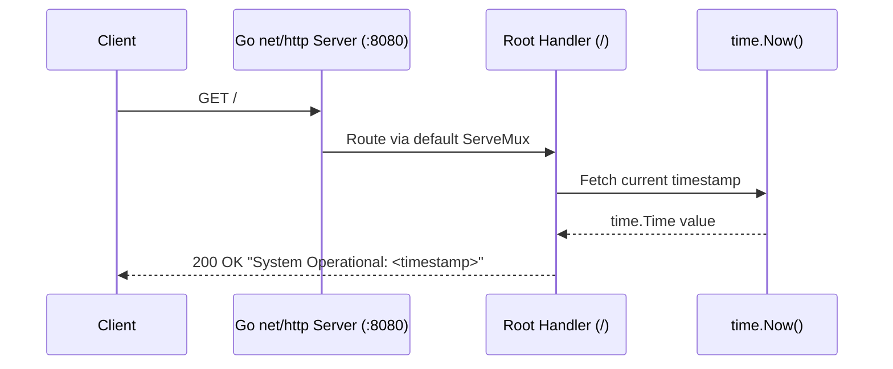
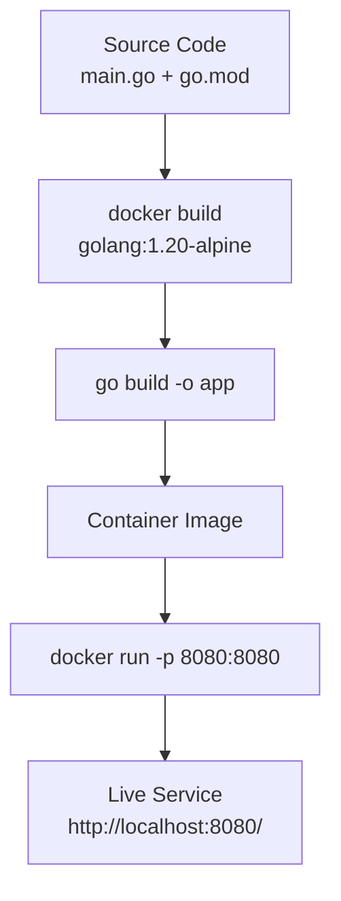
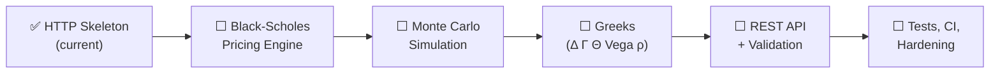

# finance-quantum-option-pricing


> A lightweight, zero-dependency Go 1.20 HTTP microservice — containerized for portable deployment and designed as the bootstrap foundation for a quantitative option-pricing engine.


---

## 🚀 Overview

This repository contains a minimal, high-performance Go 1.20 service that:

- Starts an HTTP server on port **8080**
- Responds on `/` with a live system status message and the current server timestamp
- Ships as a minimal Alpine-based Docker image runnable on any laptop or server

> ⚠️ **Honest note:** Despite the repository name, no option-pricing, Black-Scholes, Monte Carlo, or other quantitative finance logic is implemented yet. The current codebase is a **service bootstrap/skeleton** — the scaffolding onto which pricing engines are intended to be built.

## ✨ Features

- **Zero external dependencies** — uses only the Go standard library (`net/http`, `fmt`, `time`, `log`)
- **Single-binary deployment** — compiles to one executable
- **Docker-ready** — reproducible builds via the included `Dockerfile`
- **Fast startup** — Alpine-based image with a minimal footprint


## 🏗️ Architecture / How It Works

The entire application lives in `main.go` (~20 lines). Here is exactly what the code does:

1. **Entry point (`main`)** — registers a single HTTP handler on the default `ServeMux` via `http.HandleFunc("/", ...)`, then starts the server.
2. **Handler (`/`)** — on every request to the root path, the handler writes a plain-text response using `fmt.Fprintf`:
   ```
   System Operational: 2026-01-01 12:00:00.000000000 +0000 UTC
   ```
   The timestamp is generated at request time via `time.Now()`, so each response confirms the server is alive and actively serving traffic.
3. **Server bootstrap** — `http.ListenAndServe(":8080", nil)` binds to all network interfaces on port 8080 using Go's default `ServeMux`. Startup is announced via `log.Println`; if the listener fails (e.g., port already in use), `log.Fatal` prints the error and terminates the process with a non-zero exit code.

### Request Flow



### Component Structure


### Build & Deployment Pipeline



### File Layout

| File | Purpose |
|---|---|
| `main.go` | HTTP server + status endpoint (the entire application) |
| `go.mod` | Module definition (`go 1.20`), zero dependencies |
| `Dockerfile` | Build: `golang:1.20-alpine` → `go build -o app` → `CMD ["./app"]` |
| `.gitignore` | Excludes secrets (`.env`, keys), build artifacts, and OS noise |
| `LICENSE` | VisionQuantech Custom Commercial License (see below) |

## 🐳 Docker Deployment (Recommended)

The repository includes a `Dockerfile` and runs entirely with the standard Docker flow — no extra tooling required.

### Build and Run

```bash
# 1. Clone the repository
git clone https://github.com/Shivay00001/finance-quantum-option-pricing.git
cd finance-quantum-option-pricing

# 2. Build the image
docker build -t finance-quantum-option-pricing .

# 3. Run the container, mapping host port 8080 → container port 8080
docker run -d -p 8080:8080 --name option-pricing finance-quantum-option-pricing

# 4. Verify the service is live
curl http://localhost:8080/
# → System Operational: 2026-01-01 12:00:00.000000000 +0000 UTC
```

### With Docker Compose (optional)

No `docker-compose.yml` is included in the repository, but this minimal one works out of the box:

```yaml
services:
  app:
    build: .
    ports:
      - "8080:8080"
```

Then:

```bash
docker-compose up -d --build
```

### Useful Container Commands

```bash
docker logs -f option-pricing     # Stream logs
docker stop option-pricing        # Stop the service
docker rm option-pricing          # Remove the container
```

## 🛠️ Local Execution (without Docker)

Requires **Go 1.20+**:

```bash
go build -o app .
./app
# Server listens on http://localhost:8080
```

## ⚖️ Workability Assessment

An honest evaluation of the current state:

**What works:**
- ✅ The code compiles cleanly with Go 1.20 and has zero dependencies, so builds are reliable.
- ✅ The Dockerfile is valid and produces a working container that serves the status endpoint on port 8080.
- ✅ The service is genuinely deployable on any laptop or server with Docker.

**What is missing / not production-ready:**
- ❌ **No actual option-pricing functionality exists.** There is no Black-Scholes model, no Monte Carlo engine, no Greeks calculation, no market data integration — nothing quantitative is implemented yet.
- ❌ **No tests** (`*_test.go`), no CI configuration, and no linting setup.
- ❌ **No graceful shutdown** — the server does not handle `SIGTERM`/`SIGINT`; in-flight requests are dropped when the container stops.
- ❌ **No HTTP timeouts** (`ReadTimeout`, `WriteTimeout`, `IdleTimeout`), leaving it exposed to slow-client (Slowloris-style) resource exhaustion.
- ❌ **No structured logging, metrics, health/readiness split, or configuration management** — the port is hardcoded to `8080`.
- ❌ **Dockerfile inefficiencies** — copies the entire build context (no `.dockerignore`), builds without `-trimpath`/static flags, and runs as root. A multi-stage build with a `scratch` or `distroless` final stage would be significantly smaller and safer.

**Verdict:** This is a working, deployable *skeleton* — a solid starting point — but it is **not yet a functional option-pricing service and not production-ready**. Substantial feature implementation (pricing engines, input validation, API design) and hardening (timeouts, graceful shutdown, tests, non-root container) are required before real-world use.

## 🗺️ Roadmap



## 📄 License

This project is distributed under the **VisionQuantech Custom Commercial License** — see [LICENSE](./LICENSE) for full terms. Summary:

| Use Case | Terms |
|---|---|
| **Non-financial / educational** | Free |
| **Personal revenue-generating** | 15–30% gross revenue share required |
| **Business / enterprise** | Separate commercial license required — contact **visionquantech@proton.me** |

THE SOFTWARE IS PROVIDED "AS IS", WITHOUT WARRANTY OF ANY KIND.

---

<p align="center">
  
  <br/>
  <b>VisionQuantech</b> © 2026 — Built with Go 🐹
</p>