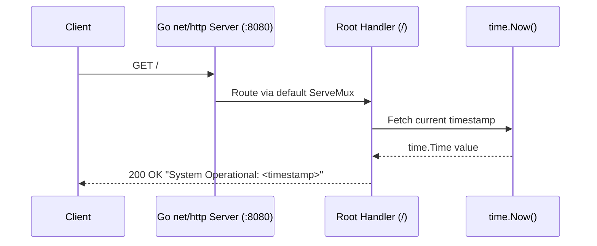
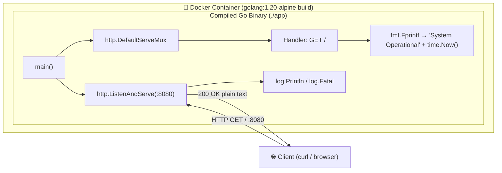
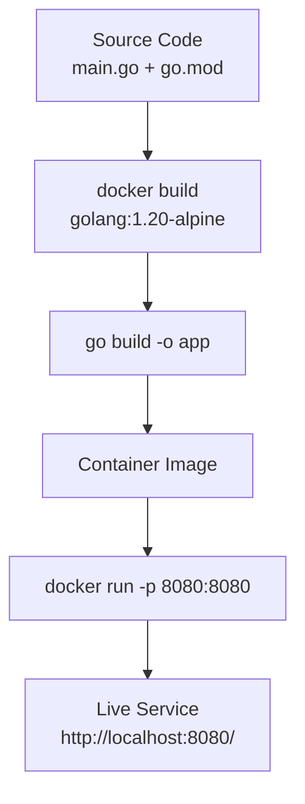
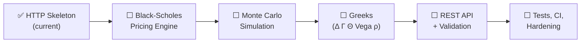

# finance-quantum-option-pricing


> A lightweight, zero-dependency Go 1.20 HTTP microservice — containerized with Docker for portable deployment and structured as the foundation for a quantitative option-pricing engine.


---

## 🚀 Overview

**finance-quantum-option-pricing** is a minimal, high-performance Go 1.20 HTTP service that:

- Starts an HTTP server listening on port **8080**
- Responds on the root path (`/`) with a live system status message and the current server timestamp
- Ships as a minimal Alpine-based Docker image, runnable on any laptop or server with Docker installed

The service is built entirely on the Go standard library and compiles to a single self-contained binary, making it an ideal bootstrap foundation for quantitative finance endpoints (option pricing, Greeks, simulation engines) to be layered on top.

## ✨ Features

- **Zero external dependencies** — uses only the Go standard library (`net/http`, `fmt`, `time`, `log`)
- **Single-binary deployment** — compiles to one executable (`app`)
- **Docker-ready** — reproducible builds via the included `Dockerfile`
- **Fast startup & small footprint** — based on the `golang:1.20-alpine` image
- **Live health signal** — every response embeds a freshly generated timestamp, confirming the server is actively serving traffic

## 🏗️ Architecture / How It Works

The entire application lives in `main.go`. Here is exactly what the code does, step by step:

1. **Entry point (`main`)** — Registers a single HTTP handler on Go's default `ServeMux` via `http.HandleFunc("/", ...)`, then starts the server.
2. **Handler (`/`)** — On every request to the root path, the handler writes a plain-text response using `fmt.Fprintf`:
   ```
   System Operational: 2026-01-01 12:00:00.000000000 +0000 UTC
   ```
   The timestamp is generated at request time via `time.Now()`, so each response reflects the exact moment the request was served.
3. **Server bootstrap** — `http.ListenAndServe(":8080", nil)` binds to all network interfaces on port `8080` using the default `ServeMux`. Startup is announced via `log.Println("Starting high-performance service on :8080")`; if the listener fails (e.g., the port is already in use), `log.Fatal` prints the error and terminates the process with a non-zero exit code.

### Request Flow



### Component Structure



### Build & Deployment Pipeline



### File Layout

| File | Purpose |
|---|---|
| `main.go` | HTTP server + status endpoint (the entire application) |
| `go.mod` | Module definition (`go 1.20`), zero dependencies |
| `Dockerfile` | Build: `golang:1.20-alpine` → `go build -o app` → `CMD ["./app"]` |
| `.gitignore` | Excludes secrets (`.env`, keys), build artifacts, and OS noise |
| `LICENSE` | VisionQuantech Custom Commercial License (see below) |

## 🐳 Running with Docker (Recommended)

The repository includes a `Dockerfile` and runs entirely with the standard Docker workflow — no extra tooling required.

### Build and Run

```bash
# 1. Clone the repository
git clone https://github.com/Shivay00001/finance-quantum-option-pricing.git
cd finance-quantum-option-pricing

# 2. Build the image
docker build -t finance-quantum-option-pricing .

# 3. Run the container, mapping host port 8080 → container port 8080
docker run -d -p 8080:8080 --name option-pricing finance-quantum-option-pricing

# 4. Verify the service is live
curl http://localhost:8080/
# → System Operational: 2026-01-01 12:00:00.000000000 +0000 UTC
```

### With Docker Compose (optional)

No `docker-compose.yml` is included in the repository, but this minimal one works out of the box:

```yaml
services:
  app:
    build: .
    ports:
      - "8080:8080"
```

Then:

```bash
docker-compose up -d --build
```

### Useful Container Commands

```bash
docker logs -f option-pricing     # Stream logs
docker stop option-pricing        # Stop the service
docker rm option-pricing          # Remove the container
```

## 🛠️ Local Execution (without Docker)

Requires **Go 1.20+**:

```bash
go build -o app .
./app
# Server listens on http://localhost:8080
```

## 🗺️ Roadmap



## 📄 License

This project is distributed under the **VisionQuantech Custom Commercial License** — see [LICENSE](./LICENSE) for full terms. Summary:

| Use Case | Terms |
|---|---|
| **Non-financial / educational** | Free |
| **Personal revenue-generating** | 15–30% gross revenue share required |
| **Business / enterprise** | Separate commercial license required — contact **visionquantech@proton.me** |

THE SOFTWARE IS PROVIDED "AS IS", WITHOUT WARRANTY OF ANY KIND.

---

<p align="center">
  <b>VisionQuantech</b> © 2026 — Built with Go 🐹
</p>